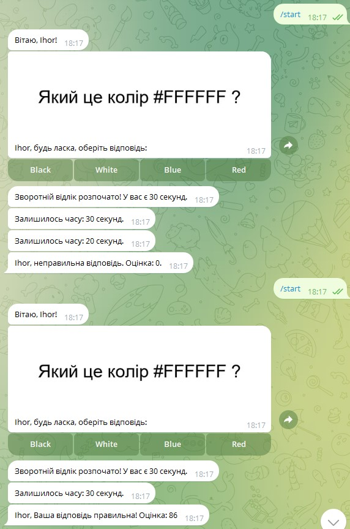

# Telegram-bot-pollster
Як створити опитувальник типа kahoot у телеграмі на aiogram 3

- Питання ставиться як малюнок (не можна скопіювати)
- Є ліміт часу
- Оцінку формуємо пропорційно витраченому часу (максимум 100 балів)
- Створив асинхронну БД sqlite, поки що там є тільки користувач, далі треба обговорити структуру БД

Далі треба зробити зчитування питання з БД та зберігати в неї відповіді користувача 

